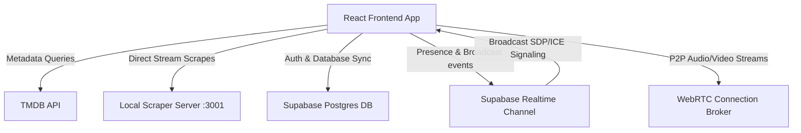

# <align align="center">🎬 AndScene! — Premium Streaming Web Experience</align>

<p align="center">
  
  
  
  
  
  
</p>

<p align="center">
  <strong>AndScene!</strong> is a high-fidelity, premium streaming platform featuring a state-of-the-art <strong>"Liquid Glass"</strong> design system. It integrates the <strong>TMDB API v3</strong> for cinematic metadata, utilizes <strong>Supabase</strong> for cross-device state synchronization and watch party signaling, and hosts a dedicated <strong>P2P WebRTC</strong> video/voice client.
</p>

---

## 📖 Table of Contents
1. [🎨 Liquid Glass Design System](#-liquid-glass-design-system)
2. [✨ Core Features Walkthrough](#-core-features-walkthrough)
3. [⚙️ System Architecture](#%EF%B8%8F-system-architecture)
4. [🛠️ Tech Stack & Dependencies](#%EF%B8%8F-tech-stack--dependencies)
5. [🚀 Installation & Setup](#-installation--setup)
6. [📂 Folder Directory Structure](#-folder-directory-structure)
7. [⚠️ Database Schema & SQL Setup](#%EF%B8%8F-database-schema--sql-setup)

---

## 🎨 Liquid Glass Design System

AndScene! utilizes custom CSS properties to deliver a premium, dark-mode cinema experience:

| CSS Variable | Color Token | Visual Application |
| :--- | :--- | :--- |
| `--bg-primary` | `#0A0A12` | Cinematic dark canvas backdrop |
| `--accent` | `#F5A623` | Active icons, progress bars, and hotkey HUD glows |
| `--accent-secondary`| `#8B5CF6` | P2P video overlays, anime tags, and charts |
| `--bg-glass` | `rgba(16, 16, 28, 0.65)` | Glassmorphism blur cards (`backdrop-filter`) |
| `--border-subtle` | `rgba(255, 255, 255, 0.08)`| Micro borders separating items |

---

## ✨ Core Features Walkthrough

### 1. 📊 Watch Stats Analytics Dashboard
A dedicated, personal dashboard summarizing your streaming habits:
*   **Milestones Grid**: Track total hours streamed, watchlist size, completed series, and daily check-in streaks.
*   **SVG Radar Preference Chart**: An inline vector spider-web chart mapping your favorite genres based on your list data.
*   **Activity Heatmap Grid**: A GitHub-style 365-day check-in calendar grid displaying active streaming days with interactive mouse-over tooltips.
*   **Unlocked Achievements**: Earn streaming badges (*Night Owl*, *Marathoner*, *Sci-Fi Voyager*, *Completionist*) as you watch.

### 2. 🔮 AI Vibe Matcher Curator
A floating, conversational chatbot helper designed to recommend content based on your mood:
*   Queries `/v1/ai/recommend` with a local keyword-matching catalog fallback.
*   Resolves recommended titles against TMDB to display interactive, clickable suggestion cards.

### 3. 🎮 Custom Native Video Player Controls
A built-in native HTML5 video player overlay that replaces standard browser controllers:
*   Custom volume sliders, scrubbers, playback speed adjustments, and fullscreen commands.
*   **Keyboard Hotkeys**: Bindings for `Space` (Play/Pause), `F` (Fullscreen), `M` (Mute), and `Arrow keys` (Seek/Volume adjustments).
*   **Subtitle Parsers**: Local SRT/WebVTT file uploaders and external URL loaders.
*   **Swipe Gestures**: Touch support for left-side brightness, right-side volume, and double-taps to skip.

### 4. 🔄 Smart Resume & Cross-Device Sync
*   Saves video seek times in browser local storage and pushes progress percentages to the Supabase database.
*   Triggers an animated pop-up banner when launching the player, allowing you to start over or resume from your last timestamp.

### 5. 👥 P2P Social Watch Parties
Create lobby rooms to stream content together in perfect sync:
*   **Lobby Directories**: Browse and join public streams hosted by other players.
*   **WebRTC Video Call**: Peer-to-peer audio/video call grids overlaid directly in the lobby sidebar.
*   **Chat and Sync Controls**: Group chat threads and host-collaborative playback sync controls.

---

## ⚙️ System Architecture



---

## 🛠️ Tech Stack & Dependencies

### Frontend Core
*   **Framework**: React 19 (lazy-loaded routes)
*   **Build Tool**: Vite 8 + Rollup bundler
*   **Routing**: React Router DOM v6
*   **Animations**: Framer Motion
*   **Icons**: Lucide React
*   **Sliders**: Swiper.js

### Scraper Backend
*   **Framework**: Node.js + Express
*   **Networking**: Axios
*   **Web Scrapers**: Cheerio HTML parser + custom regex decoders

---

## 🚀 Installation & Setup

### 1. Configure the Frontend
Create a `.env` file in the root directory:
```env
VITE_TMDB_API_KEY=your_tmdb_api_key_here
VITE_TMDB_BASE_URL=https://api.themoviedb.org/3
VITE_SUPABASE_URL=your_supabase_project_url
VITE_SUPABASE_ANON_KEY=your_supabase_anon_key
VITE_MASTER_PASSWORD=admin_panel_access_password
```

Run these commands to install dependencies and boot the developer server:
```bash
npm install
npm run dev
```

### 2. Configure the Scraper Backend
Enter the `/server` folder to configure and start the server:
```bash
cd server
npm install
node index.js
```
The server runs on `http://localhost:3001` and is accessed by the frontend to resolve direct video streams.

---

## 📂 Folder Directory Structure

```text
├── server/                    # Backend Scraper API
│   ├── index.js               # Express API and routes
│   └── package.json
├── public/                    # PWA Web Manifest & icons
└── src/
    ├── components/            # Reusable UI overlays (Player, Navbar, Skeletons)
    ├── context/               # Global state contexts (Continue Watching, Watchlists)
    ├── hooks/                 # Custom React hooks (Intersection Observer)
    ├── pages/                 # Routing Pages (Stats, Watch, Browse, Anime, Admin)
    ├── services/              # API and client initializations (Supabase, TMDB)
    ├── App.jsx                # Layout definitions and route maps
    └── index.css              # Glassmorphic layout variables and styles
```

---

## ⚠️ Database Schema & SQL Setup

To enable user profiles, watchlists, stats, and watch parties, run the following SQL queries inside your Supabase project's SQL Editor:

```sql
-- Create Watch Parties Table
CREATE TABLE public.watch_parties (
    id UUID DEFAULT gen_random_uuid() PRIMARY KEY,
    room_code VARCHAR(6) UNIQUE NOT NULL,
    room_name VARCHAR(100) DEFAULT 'Streaming Party',
    is_public BOOLEAN DEFAULT TRUE,
    host_id UUID REFERENCES auth.users(id) ON DELETE SET NULL,
    host_name VARCHAR(100) DEFAULT 'Host',
    media_id BIGINT NOT NULL,
    media_type VARCHAR(10) NOT NULL,
    title VARCHAR(255) NOT NULL,
    poster_path VARCHAR(255),
    host_control VARCHAR(20) DEFAULT 'host-only',
    season INT DEFAULT NULL,
    episode INT DEFAULT NULL,
    created_at TIMESTAMP WITH TIME ZONE DEFAULT timezone('utc'::text, now()) NOT NULL
);

-- Create Continue Watching Progress Table
CREATE TABLE public.continue_watching (
    id UUID DEFAULT gen_random_uuid() PRIMARY KEY,
    profile_id UUID NOT NULL,
    user_id UUID REFERENCES auth.users(id) ON DELETE CASCADE,
    media_id BIGINT NOT NULL,
    media_type VARCHAR(10) NOT NULL,
    title VARCHAR(255) NOT NULL,
    poster_path VARCHAR(255),
    progress INT NOT NULL DEFAULT 0,
    season INT DEFAULT NULL,
    episode INT DEFAULT NULL,
    last_watched TIMESTAMP WITH TIME ZONE DEFAULT timezone('utc'::text, now()) NOT NULL,
    CONSTRAINT unique_profile_media UNIQUE (profile_id, media_id)
);
```

---

## 📄 License
This project is for educational and portfolio purposes only. Video metadata is served courtesy of [The Movie Database (TMDB)](https://www.themoviedb.org/).
